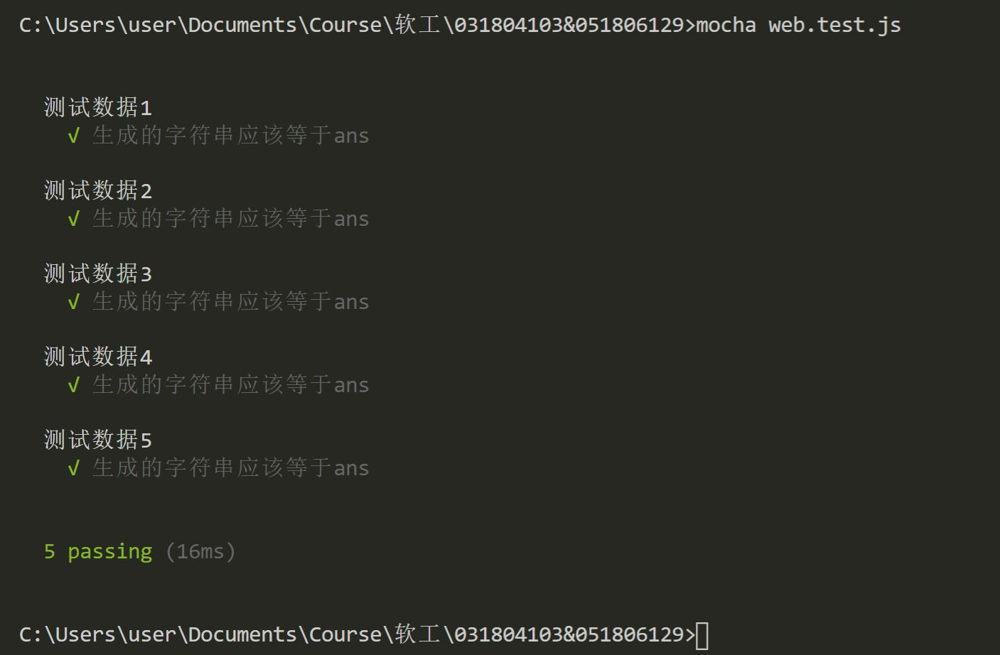

# 第二次结对作业
## 1.Information
| 这个作业属于哪个课程 | [软件工程2020秋](https://edu.cnblogs.com/campus/fzu/SE2020) |
| ----------------- |--------------- | 
| 这个作业要求在哪里| [第四次作业（结对编程第二次作业）](https://edu.cnblogs.com/campus/fzu/SE2020/homework/11277) | 
| 这个作业的目标 | 锻炼协作能力，实现部分功能 |
| 学号 | **[031804103](https://www.cnblogs.com/holmze/)**、**[051806129](https://www.cnblogs.com/KJ-23/)** |
| GitHub address | **[031804103&051806129](https://github.com/Holmze/031804103-051806129)** |
## 2.分工
- 陈：博客撰写、代码review、测试、GitHub管理
- 谢：编码实现、测试
## 3.PSP
PSP | Pair programming Process Stages | 预估耗时（分钟）|   实际耗时（分钟）
--|:--:|--:|--:
Planning|计划|15|15
Estimate|估计这个任务需要多少时间|10|10         
Development|开发|300|270
Analysis|需求分析 (包括学习新技术)|30|25       
Design Spec|生成设计文档|30| 45
Design Review|设计复审|20| 25
Coding Standard|代码规范 (为目前的开发制定合适的规范)|10| 10
Design|具体设计|120|150
Coding|具体编码|180| 240
Code Review|代码复审|45|45
Test|测试（自我测试，修改代码，提交修改）|30|45
Reporting|报告|0|0
Test Report|测试报告|30|30     
Size Measurement|计算工作量|20| 20       
Postmortem & Process Improvement Plan|事后总结, 并提出过程改进计划|20| 20|
|合计||860|940|

## 4.解题思路与设计实现
### 4.1 实现思路
使用HTML+JavaScript+CSS创建一个网页，在文本框接收特定格式的输入信息（具体的输入格式见[GitHub README](https://github.com/Holmze/031804103-051806129/blob/main/README.md)或 6.2部分），在后台解析数据为json格式，提取关键词后形成结点，从根节点开始建立学术家族树。

### 4.2 流程图

### 4.3 关键部分实现

#### 4.3.1 调用d3框架
我们使用了d3框架，**使用的时候需要联网**。
```
<head><script type="text/javascript" src="http://d3js.org/d3.v3.min.js"></script></head>
```

#### 4.3.2 接收数据
文本域textarea用于接收输入数据。
```
<p style="text-align:center">
    <textarea cols="60" rows="10" id="text"></textarea>
</p>
```

#### 4.3.3 解析数据
我们在输入格式中规定，将输入分为：```人际关系树```、```个人技能```、```职场经历```三部分，**每部分之间空行分隔**，==输入结束至少有一个空行==，所以我们按照空行分割输入数据，然后按照关键字提取节点以及节点信息和关系。
```
var content = document.all.text.value;
var edge = new Map;
var keyword = ["导师：","级硕士生：","级本科生：","级博士生："];
var seen_s_w = new Map;
var farther_flag = new Map;
var seen = [];
split_idx = [];
var farther = new Map;

// input data process
arr_str = content.split("\n");
var idx1;
var idx2;
var idx3;

for (var idx = 0 ; idx < arr_str.length ; idx ++ )
{
    if (arr_str[idx] == "")
    {
        split_idx.push(idx);
    }
}

// get teacher and student relation
for (idx1 = 0 ; idx1 < split_idx[0] ; ) // layer 1
{
    idx2 = split_idx[0];
    // get teacher
    var layer1_term = arr_str[idx1].split("：");
    var tutor_name = layer1_term[1];

    edge[tutor_name] = [];
    seen.push(tutor_name);
    for (idx3 = idx1 + 1 ; idx3 < idx2 ; idx3 ++)
    {
        var layer1_item = arr_str[idx3].split("：");
        var layer1_node = layer1_item[0] + tutor_name;
        farther[layer1_item[0]] = tutor_name;
        edge[tutor_name].push(layer1_node);
        edge[layer1_node] = [];
        farther_flag[layer1_node] = 1;
        seen.push(layer1_node);
        var student = layer1_item[1].split("、");
        for (var stu of student)
        {
            farther[stu] = layer1_node;
            stu = stu + layer1_node;
            farther[stu] = layer1_node;
            edge[layer1_node].push(stu);
            farther_flag[stu] = 1;
            seen.push(stu);
        }
    }
    idx1 = idx2 + 1;
}
//console.log(farther);
if (split_idx.length >= 2)
{
    for (idx3 = idx1 ; idx3 < split_idx[1] ; idx3 ++)
    {
        var layer2_item = arr_str[idx3].split("：");
        var current_f = farther[layer2_item[0]];
        var layer2_node = layer2_item[0] + current_f;
        edge[layer2_node] = [];
        farther_flag[layer2_node] = 1;
        seen.push(layer2_node);
        var skill_or_work = layer2_item[1].split("、");
        for (var sw of skill_or_work)
        {
            edge[layer2_node].push(sw);
            farther_flag[sw] = 1;
            seen.push(sw);
            seen_s_w[sw] = 1;
        }
    }
}
//		console.log(edge);
if (split_idx.length == 3)
{
    for (idx3 = split_idx[1] + 1 ; idx3 < split_idx[2] ; idx3 ++)
    {
        var layer3_item = arr_str[idx3].split("：");
        var current_f = farther[layer3_item[0]];
        var layer3_node = layer3_item[0] + current_f;
        edge[layer3_node] = [];
        farther_flag[layer3_node] = 1;
        seen.push(layer3_node);
        var work = layer3_item[1].split("、");
        for (var w of work)
        {
            edge[layer3_node].push(w);
            farther_flag[w] = 1;
            seen.push(w);
            seen_s_w[w] = 1;
        }
    }
}
// find root node
for (var val of seen)
{
    if (farther_flag[val] == null)
    {
        var root_name = val;
    }
}
//console.log(root_name);
```

#### 4.3.4 DFS算法
我们在处理完输入数据后，使用DFS（Depth First Search）算法按照输入格式代表的结点关系构建json树。
```
        function dfs(n,f) // construct object
		{
			console.log(n,f);
			var obj;
			obj = {};
			obj.name = n;
			obj.children = [];
			var item_list = edge[n];


			if (item_list == null)
			{
			    //console.log(n);
				if (seen_s_w.hasOwnProperty(n) == false)
				obj.name = n.substring(0,n.indexOf(f));

				return obj;
			}

			for (var i = 0 ; i < item_list.length ; i ++)
			{
				obj.children.push(dfs(item_list[i],n));
			}

			if (n.indexOf(f) != -1) // no farther
			{
				var c = n.substring(0,n.indexOf(f));
				obj.name = c;
			}

			return obj;
        }
```
## 5.附加特点设计与展示
### 5.1 学术家族树的缩放与拖动功能
```
// Transition nodes to their new position.将节点过渡到一个新的位置-----主要是针对节点过渡过程中的过渡效果
//node就是保留的数据集，为原来数据的图形添加过渡动画。首先是整个组的位置
var nodeUpdate = node.transition()  //开始一个动画过渡
    .duration(duration)  //过渡延迟时间,此处主要设置的是圆圈节点随斜线的过渡延迟
    .attr("transform", function(d) { return "translate(" + d.x + "," + d.y + ")"; });//YES


// Transition exiting nodes to the parent's new position.过渡现有的节点到父母的新位置。
//最后处理消失的数据，添加消失动画
var nodeExit = node.exit().transition()
    .duration(duration)
    .attr("transform", function(d) { return "translate(" + source.x + "," + source.y + ")"; })//YES
    .remove();

// Update the links…线操作相关

//再处理连线集合
var link = svg.selectAll("path.link")
    .data(links, function(d) { return d.target.id; });


// Enter any new links at the parent's previous position.
//添加新的连线
link.enter().insert("path", "g")
    .attr("class", "link")
    .attr("d", function(d) {
        var o = {y: source.x0, x: source.y0};//YES
        return diagonal({source: o, target: o});  //diagonal - 生成一个二维贝塞尔连接器, 用于节点连接图.
    })
    .attr('marker-end', 'url(#arrow)');

// Transition links to their new position.将斜线过渡到新的位置
//保留的连线添加过渡动画
link.transition()
    .duration(duration)
    .attr("d", diagonal);

// Transition exiting nodes to the parent's new position.过渡现有的斜线到父母的新位置。
//消失的连线添加过渡动画
link.exit().transition()
    .duration(duration)
    .attr("d", function(d) {
        var o = {x: source.x, y: source.y};//NO
        return diagonal({source: o, target: o});
    })
    .remove();

// Stash the old positions for transition.将旧的斜线过渡效果隐藏
nodes.forEach(function(d) {
    d.x0 = d.y;
    d.y0 = d.x;
});
}
```
### 5.2 学术家族树结点的折叠功能
```
//定义一个将某节点折叠的函数
// Toggle children on click.切换子节点事件
function click(d) {
if (d.children) {
    d._children = d.children;
    d.children = null;
} else {
    d.children = d._children;
    d._children = null;
}
update(d);
}
```
## 6.目录说明和使用说明
### 6.1 目录说明

- title部分保存页面标题，即显示在浏览器标签上的标题
- style保存页面设计设计风格信息
- 在head部分调用d3框架
- 在body构建页面的具体部件以及部件信息
  - body.spript中放置JavaScript代码作为后台运行代码
### 6.2 使用说明
#### step1
首先使用chrome浏览器打开web.html文件

#### step2
按照输入格式在文本框输入文本，并点击下方的```提交```键

#### step3
在```提交```键下方出现学术家族树，并支持用鼠标的滚轮缩放以及鼠标拖动家族树

## 7.单元测试
使用macha测试框架

## 8.GitHub记录
## 9.遇到的代码模块异常或结对困难及解决方法
## 10.评价你的队友